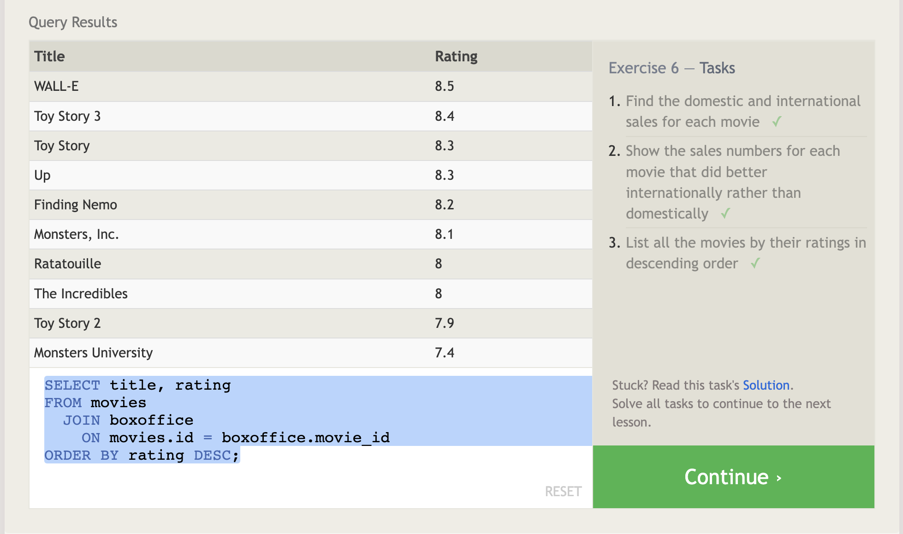

# Introduction to SQL

SQL stands for Structured Query Language. Databases are organized into tables. Using various SQL commands we can retrieve and manipulate data from such databases.

SQL Command Examples:

`SELECT` - extracts data from a database
`UPDATE` - updates data in a database
`DELETE` - deletes data from a database
`FROM` - specifies table
`ORDER BY` - specify data display order. use `ASC` and `DESC` (ascending and descending)
`LIMIT` - limit the number of results returned
`OFFSET` - specify where the data returned will start from
`WHERE` - set conditions to filter data (ex. WHERE column_name = specified_value)
`CREATE TABLE` - creates a new table
`ALTER TABLE` - modifies a table

## Sources

* *[Learn SQL]*(<https://landing.chartio.com/download-learn-sql>)
* *[W3Schools - SQL Syntax]*(<https://www.w3schools.com/sql/sql_syntax.asp>)

### SQL Tutorials

